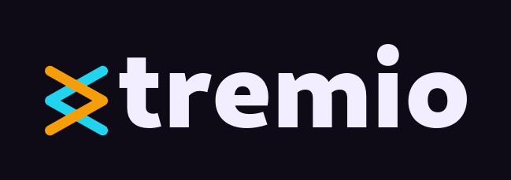

# Xtremio



A native, cross-platform **Stremio client** built on a Rust core with a
Flutter UI, for Android TV and Google TV, Android phones and tablets, and
Linux, Windows and macOS desktops. iOS is not carried
([Platform support](#platform-support)).

[](https://github.com/zond/xtremio/actions/workflows/ci.yml) [](#license) [](#license)

Xtremio is the client half of a two-part project. The other half is
[`zond/stream-server`](https://github.com/zond/stream-server), a headless
torrent-streaming server written in Rust, which Xtremio embeds in its own
process. It pairs that with
[`stremio-core`](https://github.com/Stremio/stremio-core) -- the official Rust
engine for addons, catalogs, library and playback state, built here from a
[fork](docs/ARCHITECTURE.md#pinned-forks) -- and
[`media_kit`](https://pub.dev/packages/media_kit)/libmpv for playback.

## What it does

What Stremio's own apps do -- catalogs and search across every installed
addon, a library, an account, playback state -- this app does through the
same engine, [`stremio-core`](https://github.com/Stremio/stremio-core), and
draws its own way (Discover names the catalogs that could *not* answer, so
a dead addon is never mistaken for a title nobody has; a title's sources are
a row per release, a section per resolution, ranked by peers per megabyte).
The list below is what it does that they do not; all of it runs today, and
[docs/STATUS.md](docs/STATUS.md) is the screen-by-screen inventory.

- **Torrent streaming with no external binary.** `stream-server` runs
  in-process on loopback: nothing to ship beside the app, launch, or keep
  alive on mobile. A torrent starts behind a card that says what it is doing
  -- checking, finding peers, buffering -- instead of a spinner, a stall
  later says *Buffering from the torrent* with the swarm's numbers, and every
  stream the app plays -- a torrent, an addon's direct link, a debrid link,
  a Drive file -- is cached and read ahead of the player by the server,
  inside one bounded cache.
- **Offline downloads of any source.** A download is a pin in the embedded
  server -- a torrent file kept piece by piece, an addon link or a Google
  Drive file kept in the same cache -- and never exists as a whole file. It
  plays offline through the same server once the server answers that it
  holds the file whole; on Android a foreground service keeps one going
  after the app is left.
- **Google Drive as a source.** A phone pairs the app with a Drive account
  through a QR code and picks files; they appear under the titles they
  match, play through the server (which renews the token itself), download
  like any other source and play offline once downloaded. The grant lives in
  the platform's secure store and is never in a URL or a log.
- **A player rather than a video widget.** Buffered seek bar, keyboard and
  remote shortcuts, audio tracks, embedded and addon subtitles, a stats OSD
  reporting hwdec, the swarm, what this device holds of the stream either
  side of the playhead and what a torrent has committed and moved since it
  went live, and an up-next countdown that hands over to the next episode.
- **Subtitle timing that is nudged or measured, and then remembered.** Shift
  the lines by hand from a panel that survives the controls fading, mark a
  line where it belongs and let two marks give the rate, or have the drift
  measured against another subtitle the viewer says is in sync -- which is
  where a stretch comes from, since nothing here presses a multiplier and no
  declared frame rate decides one. What was fixed is stored against the
  series and the subtitle's release group (a shift against the video release
  too), so the next episode starts right
  ([docs/ARCHITECTURE.md](docs/ARCHITECTURE.md#subtitles)).
- **Android TV and Google TV as their own layout**, not a phone app on a big
  screen: D-pad traversal with a focus memory per tab, a focus ring built to
  read over unknown poster art, remote keys in the player, ten-foot density
  and overscan. Run on a physical Chromecast with Google TV
  ([docs/ANDROID.md](docs/ANDROID.md)).
- **Casting to a Chromecast** from an Android phone. What the film is comes
  from mpv's report of the bytes alone, never a file name: a film the
  receiver decodes goes over the LAN untouched; an H.264 or HEVC film in
  Matroska, or one whose sound the receiver will not take, goes repackaged
  as one fragmented MP4 with its sound converted to AAC and its picture
  never re-encoded, so a picture no receiver decodes is refused up front
  with a sentence saying why. The receiver fetches from a listener that
  exists only while a cast does and serves published tokens and nothing
  else; the player screen becomes a remote with its own stats panel. One
  real receiver, a Chromecast with Google TV 4K, has played and seeked it
  ([docs/CASTING.md](docs/CASTING.md)).
- **Sharing you can see and stop.** Xtremio shares while you watch, while a
  torrent download is on its way, and -- *Share while idle*, on by default
  -- your downloads and the last thing you watched until you watch something
  else, except on a phone in the background. A status light on the main
  screens is lit only while bytes move with nothing playing: up for
  uploading, down for an offline download filling in. Pressed, it offers
  *Not now*, *Stop sharing*, or a *Cancel* per download on its way.
- **More like this.** A row of suggestions on every title, asked of a model
  once per title for everybody by this project's own service -- no key in
  the app -- and shown only when a catalogue confirms the title and year
  ([docs/ARCHITECTURE.md](docs/ARCHITECTURE.md#recommendations)).
- **Addons installed from the web.** An addon site's Install button hands the
  OS a `stremio://` link; where Xtremio can register that scheme it opens
  that addon's details screen, and nothing is installed until the button
  waiting there is pressed. The contract in full, and the registration per
  platform, is in [docs/DEEP_LINKS.md](docs/DEEP_LINKS.md).

## Getting it

Every version tag builds Linux, Windows, macOS and both Android ABIs and
attaches them to a [GitHub Release](https://github.com/zond/xtremio/releases).
The macOS build is unsigned. The APKs carry this project's own release key;
to Android a signing certificate *is* the app's identity, so upgrading from
a build signed with another key needs an uninstall first. Once installed,
the app looks for a newer release once a day and offers it -- on Android it
first cleans the server's cache to make room (never a kept download), then
downloads, verifies and installs it behind Android's own confirmation
([docs/ANDROID.md](docs/ANDROID.md#updating-from-inside-the-app)).

## Building, testing, driving, releasing

Flutter stable and a Rust toolchain (or the Nix shells); `make run
DEVICE=linux` runs it and `make check` runs every gate CI runs. The setup
and the targets are in [docs/OPERATIONS.md](docs/OPERATIONS.md), the
Android and TV builds in [docs/ANDROID.md](docs/ANDROID.md), driving a
running build from a terminal in [docs/DRIVING.md](docs/DRIVING.md), the
gates and the rules a test keeps in [AGENTS.md](AGENTS.md), and a release
is a version tag ([docs/OPERATIONS.md](docs/OPERATIONS.md#cutting-a-release)).

## How it works

```
┌──────────────────────────────────────────────────────────────┐
│  Flutter UI (this repo) — screens, navigation, playback UI   │
├──────────────────────────────────────────────────────────────┤
│  Dart ⇄ Rust FFI (flutter_rust_bridge), crate in rust/       │
│   • stremio-core   → addons, catalogs, search, library,      │
│                      account, playback state (the "brain")   │
│   • stream-server  → embedded: settings, stats, storage and  │
│                      downloads as FFI calls                  │
├──────────────────────────────────────────────────────────────┤
│  media_kit / libmpv — reads the media from the server by id  │
│  (xtremio://, no HTTP), decodes and renders it (direct play; │
│  codecs and subtitles on-device)                             │
└──────────────────────────────────────────────────────────────┘
```

The UI stays thin: discovery/library/addon logic lives in `stremio-core`, the
bytes come from `stream-server`, and the client's job is presentation plus
driving libmpv. `stream-server` runs **in-process**: the Rust crate in `rust/`
links it as a library and starts it on its own thread with its own runtime,
bound to `127.0.0.1` on a port the OS picks and pointing stremio-core at
the address it reads back (the only server the app streams from), so no
sidecar binary ships and no fixed port is lost to a desktop Stremio. The
Dart side never speaks HTTP to it: libmpv reads what it plays by media id
through an `xtremio://` protocol registered on its handle
(`rust/src/mpv_stream.rs`), fetching a loopback route only for a link the
server reads forward; the app's own questions -- settings, a torrent's
stats, storage, downloads, publishing a cast -- are FFI calls into the
server's library API; and stremio-core's requests to it carry a per-launch
bearer token that only the Rust side holds. The only HTTP it serves beyond loopback is the media listener
a cast session turns on and off. Because a capable on-device player handles
codecs and subtitles, the server never transcodes a picture -- it gets bytes
to the player, and for a cast at most repackages them and converts the
sound.

How that bridge is built, what crosses it and what every field of the state
means is in [docs/ARCHITECTURE.md](docs/ARCHITECTURE.md).

Every git dependency in `rust/Cargo.toml` is pinned to a rev with its
reason beside it: the three forks are listed in
[docs/ARCHITECTURE.md](docs/ARCHITECTURE.md#pinned-forks).

## Platform support

The hard constraint is **BitTorrent**: raw sockets, a local server, a disk
cache and libmpv. That decides everything.

| Platform | Support | Notes |
|---|---|---|
| **Linux (desktop)** | ✅ First-class | The easiest target; video is software-rendered until media_kit's Linux renderer lands ([docs/OPERATIONS.md](docs/OPERATIONS.md#linux-video-is-software-rendered-for-now)). |
| **Windows (desktop)** | ✅ Built weekly in CI (`build.yml`) | Flutter desktop, media_kit and native Rust, as on Linux; registering `stremio://` needs an installer and there is none ([docs/DEEP_LINKS.md](docs/DEEP_LINKS.md)). |
| **macOS (desktop)** | ✅ Built weekly in CI (`build.yml`) | Native Rust + media_kit; unsigned, and needs a Mac to build yourself -- there is none in the project. |
| **Android** | ✅ Supported | Rust cross-compiles to the NDK and is embedded as a native lib; the primary mobile target ([docs/ANDROID.md](docs/ANDROID.md)). |
| **Android TV / Google TV** | ✅ Supported | The same app, not a separate build; install the APK for the ABI the box reports -- a Chromecast with Google TV is 32-bit, `make apk-tv` ([docs/ANDROID.md](docs/ANDROID.md#running-on-a-physical-device)). |
| **iOS** | ❌ Does not build as checked in | Two upstream dependencies do not build for iOS as released; with the two changes in [docs/OPERATIONS.md](docs/OPERATIONS.md#building-for-ios) it compiles. Past that, there is no signing identity here, the App Store is out on GPL-3 (see [License](#license)), and iOS throttles background work. |
| **Web** | ❌ Not possible | A browser cannot do BitTorrent -- no raw sockets, no local server, no libmpv. A thin client onto a separate server is a different architecture, not this app. |

## What is next

What is genuinely not built, and why, is in
[docs/WISHLIST.md](docs/WISHLIST.md): subtitles on a receiver, pictures a
receiver cannot decode (refused, never re-encoded), the remote's own search
key, Continue watching on the Google TV home screen, and archives the server
cannot yet read inside.

## What is written down where

| Document | What is in it |
|---|---|
| [docs/STATUS.md](docs/STATUS.md) | What is built today, screen by screen. |
| [docs/ARCHITECTURE.md](docs/ARCHITECTURE.md) | How it works: the bridge and what crosses it, the wire conventions, the embedded server, the player, subtitles, downloads, Google Drive, the library, recommendations, and the pinned forks. |
| [docs/OPERATIONS.md](docs/OPERATIONS.md) | Setting up, building and running, cutting a release, re-recording fixtures, server storage, diagnostics, the stats OSD, and what an iOS build needs. |
| [docs/ANDROID.md](docs/ANDROID.md) | Android and Android TV: prerequisites, the APK, manifest and channels, display frame rate, downloads in the background, emulators, a real box. |
| [docs/DRIVING.md](docs/DRIVING.md) | Driving a running app from a terminal or an agent: the side-by-side debug app, `tool/drive-start`, `tool/drive` and its commands. |
| [docs/CASTING.md](docs/CASTING.md) | The cast button: what it hands a receiver untouched, what it repackages, and every rule it refuses on. |
| [docs/ADDONS.md](docs/ADDONS.md) | How each installed addon has been answering, and the verdict the Installed tab reads off that record. |
| [docs/DEEP_LINKS.md](docs/DEEP_LINKS.md) | What a `stremio://` link may and may not do, and how the scheme is registered on each platform. |
| [docs/WISHLIST.md](docs/WISHLIST.md) | What is deliberately not built yet, and why. |
| [AGENTS.md](AGENTS.md) | The rules a change has to keep: commits, the verification gates, tests and fixtures, and the invariants the code depends on. |
| [xtremio-xervice/README.md](xtremio-xervice/README.md) | The Firebase service behind Drive pairing, Drive play tracking and recommendations. |
| [tool/recommendations/README.md](tool/recommendations/README.md) | How the recommendation model and question were chosen, and the benchmarks. |

## Contributing

[AGENTS.md](AGENTS.md) is what a change has to satisfy here: single-concept
commits, the verification that gates them (CI runs the same checks on every
push and pull request), and the rules a real television taught us. Read it
before opening a pull request.

## License

The **source** here is MIT ([LICENSE](LICENSE)). A **compiled** Xtremio embeds
`stream-server`, which links `unrar-rs` (GPL-3.0-or-later) so a RAR archive in
a torrent plays: **distributed binaries are GPL-3.0-or-later**
([LICENSE-GPL-3.0](LICENSE-GPL-3.0)). unrar-rs asks that a binary reproduce its
licence file, the unRAR restriction included, so that text ships in the app too
([LICENSE-unrar-rs](LICENSE-unrar-rs); Settings → About → Open source
licences). `stream-server` with `default-features = false` drops both.
